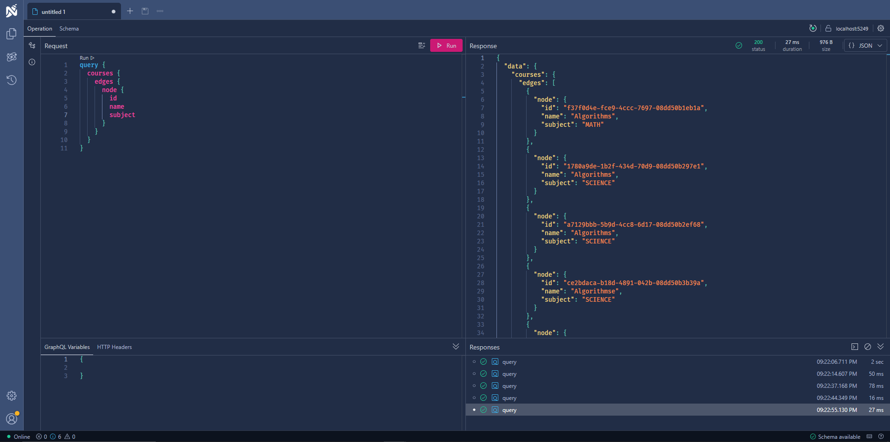

# 🛠️ GraphQL API Prototype — GraphQL Core Concepts Prototype • (Archived)

 

## 📌 Project Overview

This project is a **GraphQL API prototype** created to explore and implement a wide range of **GraphQL features** in a structured environment.  
It focuses on understanding the **core capabilities of GraphQL**, including schema design, queries, mutations, resolvers, data loading, authentication, and authorization.  
> 📦 **Archived** — This project is no longer being updated. It’s kept as part of my learning history and serves as a technical reference for future projects.

 

## 🖼️ Screenshots
Shown below in order:  
**1. Schema**

  
  
  

 

## 🧰 Tech Stack

  
  
  

 

## 📜 License
This project is licensed under the [MIT License](./LICENSE).

---

© 2025 Yusuf Okan Sirkeci — [Hereetria](https://github.com/Hereetria)
